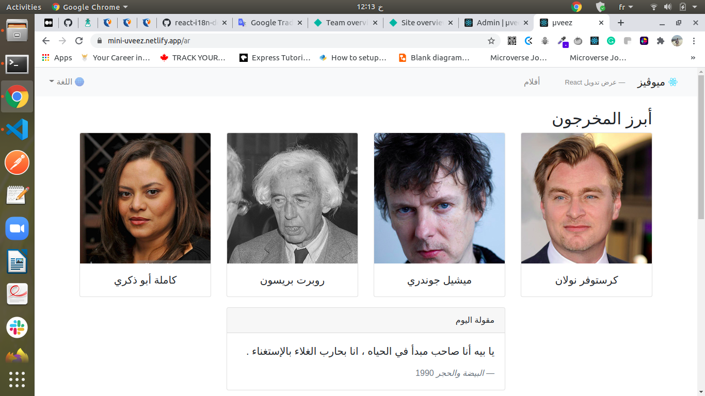
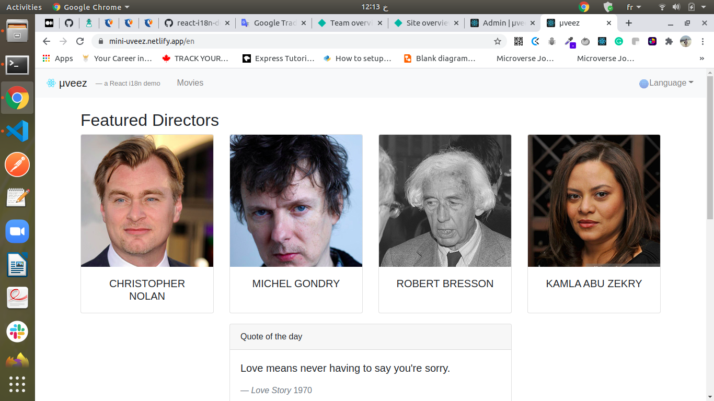
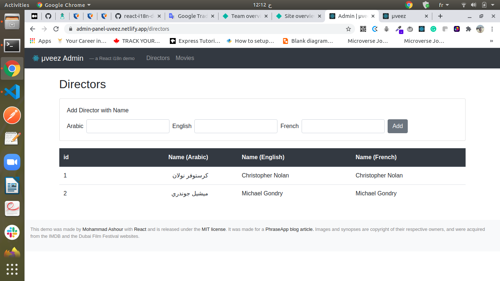

# PROJECT: μveez 
## The movie magazine app 

μveez is a single-page and multilanguage movie magazine app, built with React & Redux.

it contains two i18n-ized React / Redux SPAs: an admin backend and a front-facing app, with many of the react i18n and l10n bells and whistles that production apps would need.

## Front-facing app

## Admin-panel app

> This project is a tutorial to learn about React and I18n from  [Phraze](https://phrase.com/blog/posts/react-i18n-app/).

## Live Demos

[Front-facing app](https://mini-uveez.netlify.app/).

[Admin-panel app](https://admin-panel-uveez.netlify.app/).

## Built With

Our entire framework (with versions at time of writing) can, then, look like this.

- React (16.8)
- Redux (4.0)
- React Redux (6.0)
- Redux Thunk (2.3) —for asynchronous redux actions
- React Router DOM (5.0) —for browser routing
- i18next (15.0) —for i18n-ized UI
- Bootstrap (4.3)
- Bootstrap4-rtl (4.0) —for right-to-left CSS layout
- Reactstrap (8.0) —for Bootstrap React components
- Lodash (4.17) —for JavaScript utilities

## Features

### General
- μveez will initially support Arabic, English, and French.

### Admin
- Film director index with names in supported locales.
- Adding a director with translations in supported locales.
- Movie index with titles in supported locales.
- Adding a movie with translated titles and synopses in supported locales.

### Front
- Language switching between our supported locales, covering RTL directionality for Arabic.
- Home page with featured directors, quote of the day, and featured movies.
- Movie index.
- Single (show) movie.

To get a local copy up and running follow these simple example steps.

### Prerequisites

1. Git.
2. Code editor.
3. Code linter.

## How to run the program

1. Open the terminal.

2. Enter `git clone git@github.com:othman-19/uveez-i18n-react.git`.

3. Navigate to the cloned repository.

4. In the terminal cd into uveez-i18n-react.

5. Run `npm install` in your terminal.

6. Run `npm run start` in your termianl.

7. Open [http://localhost:3000](http://localhost:3000) to view it in the browser.

## Author(s)

[Othamane Naamani](https://github.com/othman-19/).

## Contact

[Othmane Namani](https://github.com/othman-19/)  
[Email: othmanenaamani@gmail.com](mailto:othmanenaamani@gmail.com)  
[Portfolio](https://othman-19.github.io/my_portfolio/)  
[LinkedIn](https://www.linkedin.com/in/othman-namani/)  
[Twitter](https://twitter.com/ONaamani)  
[DEV Community](https://dev.to/othman)  
[Angel List](https://angel.co/othmane-namani)  

## 🤝 Contributing

Contributions, issues and feature requests are welcome!

Feel free to check the [issues page](issues/).

## Show your support

Give a ⭐️ if you like this project!